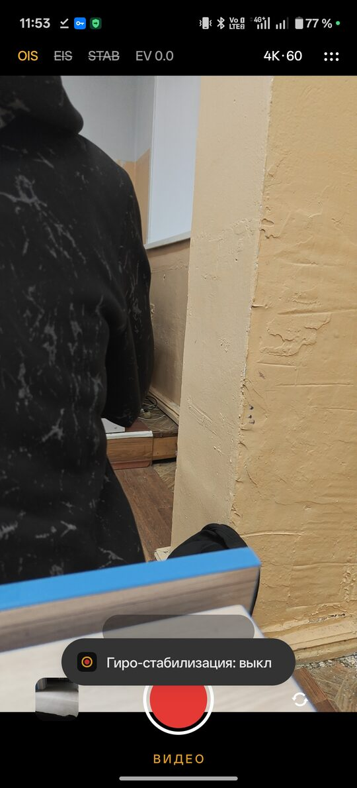

# StabCam — видеокамера для Snapdragon с аппаратной стабилизацией

Android-приложение, которое умеет только снимать видео: 4K 60 fps, HEVC, высокий битрейт,
**аппаратный OIS включён, стоковый EIS выключен**. Без кропа, «мыла» и «желе» от стокового EIS.
Целевое устройство — **OnePlus 15R** (Snapdragon), но работает на любом Android 12+ с Camera2.

> **Статус: v0.1 — базовая версия.** Запись видео + OIS + система конфигов + nightly-сборки.
> Своя гиро-стабилизация в реальном времени (уровень GoPro RockSteady / DJI) — следующий этап, см. [Дорожную карту](#дорожная-карта).

[](../../actions/workflows/build.yml)
[](../../actions/workflows/nightly.yml)

---

## Скачать

Последняя ночная сборка лежит в релизе **[nightly](../../releases/tag/nightly)** (файл `StabCam-nightly.*.apk`).
Релиз пересобирается каждую ночь, если с прошлой сборки появились новые коммиты, а также при каждом пуше в ветку по умолчанию.

Один раз придётся удалить ранее установленную сборку: у неё другая подпись.

## Возможности v0.1

| | |
|---|---|
| Режимы | только **ВИДЕО** |
| Качество | 4K·120 (high-speed), 4K·60, 4K·30, 3.3K·60, 1080·60, 1080·30 (показываются только поддерживаемые камерой) |
| Кодек | HEVC (H.265), 10-бит HLG по кнопке, откат на H.264, если HEVC-энкодер не тянет выбранный режим |
| Битрейт | 4K60 — 120 Мбит/с по умолчанию, настраивается в конфиге |
| Звук | AAC 256 кбит/с, 48 кГц, стерео |
| Стабилизация | аппаратный **OIS** (вкл/выкл), стоковый **EIS** (по умолчанию выкл) |
| Управление | EV-компенсация, зум 0,6 / 1× / 2× / 5× (если камера отдаёт логический зум), смена камеры |
| Сохранение | `Movies/StabCam/STAB_yyyyMMdd_HHmmss.mp4`; ориентация записывается в метаданные |
| Интерфейс | как в стоковой камере: панель-«пилюля» сверху, круглая кнопка записи, превью последнего ролика, иконки поворачиваются вместе с телефоном |

### Почему OIS вкл, а EIS выкл

* **OIS** (оптическая стабилизация) двигает линзу или сенсор *во время экспозиции*: убирает мелкую тряску рук и смаз внутри кадра, не обрезает картинку и не портит детализацию.
* **Стоковый EIS** обрезает кадр, растягивает его обратно (отсюда «мыло») и часто «плывёт» при быстрых движениях.
  В StabCam он выключен (`CONTROL_VIDEO_STABILIZATION_MODE_OFF`), его можно включить кнопкой `EIS` для сравнения.
* Своя гиро-стабилизация (следующий этап) будет работать *поверх* OIS и учитывать сдвиги OIS (`STATISTICS_OIS_SAMPLES`), если камера их отдаёт.

## Гиро-стабилизация (v0.2, в разработке)

Кнопка **STAB** вверху. Включена: кадры идут Camera2 → OpenGL → HEVC, превью показывает уже стабилизированную картинку.

* Гироскоп 400 Гц интегрируется в ориентацию камеры, часы те же, что у кадров (`REALTIME`).
* «Виртуальная камера» едет с постоянной скоростью намеренного движения и подтягивается к реальной ориентации фильтром: плавная панорама идёт без лага, дрожь гасится. Отклонение ограничено запасом кропа (`stab.maxAngleDeg`, `stab.crop`).
* Для каждого кадра считаются 8 матриц по строкам матрицы (rolling shutter), шейдер собирает картинку по интринсикам линзы.
* **Долгое нажатие на STAB** перебирает варианты осей гироскопа (8 штук). Если при тряске телефона картинка не стоит на месте, а «убегает» или дёргается сильнее, переключайте, пока не станет ровно, и сообщите вариант.
* Работает только на основной камере и не в режиме 4K·120 (high-speed). Ультраширик (зум <1×) идёт без коррекции.
* **Адаптивный кроп:** зум-запас растёт только когда рука трясётся и возвращается к минимуму (`stab.minCrop` 1.03 … `stab.crop` 1.12), поэтому в спокойных сценах картинка резче, а при сильной тряске не упирается в границу.
* **Качество картинки после warp:** бикубический ресемплинг Catmull-Rom (9 выборок) вместо билинейного и мягкая резкость с ограничением выбросов (без «ореолов»). Настройки `stab.bicubic`, `stab.sharpen` (0..1).
* **Шумоподавление по времени:** предыдущий кадр перепроецируется на текущий по повороту гироскопа и усредняется с ним там, где картинка совпадает (шум); там, где отличается (движение), берётся новый кадр, поэтому «призраков» нет. Сила `stab.denoise` (0..1, 0 = выкл), допуск шума `stab.denoiseSigma`. Меньше шума в тенях при том же битрейте, файл не растёт.
* **Размер файлов:** HEVC с B-кадрами (если энкодер их принимает), VBR; битрейты по умолчанию ниже прежних (4K60 80, 4K30 50, 1080p60 25 Мбит/с). Меняются в `video.bitrateMbps`.
* Статистика (fps, время кадра, поправка в градусах, отставание гироскопа) пишется в лог каждые 2 секунды, метка `Stab`.

## Моды (`.module`)

Мод — один JSON-файл с расширением `.module`, который может нести **настройки**, **LUT-ы** (inline `.cube`) и **пресеты**. Пример: [`docs/example.module`](docs/example.module).

```json
{ "module": 1, "id": "user.my-mod", "name": "Название", "version": "1.0", "description": "…",
  "config":  { "stab": { "denoise": 0.6 }, "video": { "lut": "cinema" } },
  "luts":    [ { "name": "Мой стиль", "cube": "LUT_3D_SIZE 17\n…" } ],
  "presets": [ { "name": "Прогулка", "config": { "stab": { "crop": 1.1 } } } ] }
```

Настройки → **Моды**:

* **Скопировать промпт для нейросети** → вставить в чат с ИИ, описать нужный мод → скопировать ответ → **Вставить мод из буфера**.
* **Установить из файла** (`.module`; файл также открывается из «Файлов» и мессенджеров через «Открыть с помощью → StabCam») и **Вставить ссылку** (https).
* Перед установкой показывается, что мод изменит. В модах **нет кода**: настройки проверяются по списку разрешённых ключей (нельзя менять адрес обновлений, vendor-ключи камеры и т.п.).
* Включение/выключение и удаление каждого мода; LUT-ы модов появляются в списке LUT, пресеты можно применять одним нажатием.
* **Поделиться моим стилем** экспортирует текущие настройки как мод.

Порядок слоёв конфига: по умолчанию → пресет устройства → **включённые моды** → ваши правки.

## Простой и «Про» режимы

Настройки → «Режим интерфейса». **Простой**: на экране камеры только `Стаб`, LUT, качество и меню; в настройках две вкладки («Главное»: качество, стабилизация, чистота картинки, HDR, стиль; «Моды»). **Про**: все кнопки (OIS, EIS, STAB, HLG, EV) и вкладки Видео · Стабилизация · Цвет · Моды · Система · Продвинутые. Режим переключается и из выпадающего меню (шесть точек).

## Режим ПОСТ (запись для обработки после съёмки)

Включается в Настройки → Продвинутые → «Режим ПОСТ» (в обычном интерфейсе его нет). В этом режиме ролик пишется *без* обработки (без кропа, шумоподавления, резкости и LUT), битрейт ×1.5 (`post.bitrateFactor`), потому что потом он пройдёт ещё один проход. Одновременно ведётся точный лог:

* `files/post/<имя>.gcsv`: гироскоп с метками времени в миллисекундах относительно первого кадра, в формате **Gyroflow** (`orientation,Xyz`, рад/с). Копия кладётся в `Download/StabCam/` (отключается `post.exportGcsv: false`), чтобы импортировать в Gyroflow на ПК рядом с видео. Если картинка в Gyroflow стабилизируется «в обратную сторону», поправьте там поле Orientation.
* `files/post/<имя>.meta.json`: размер, fps, интринсики линзы, ориентация, rolling shutter, оси гироскопа, **время каждого кадра и выдержка**. Это то, что нужно офлайн-обработке на телефоне (следующая часть).

### Обработка на телефоне (Настройки → Продвинутые → «Обработка записей ПОСТ»)

Берёт ролик, снятый в режиме ПОСТ, и делает новый файл `<имя>_POST.mp4` рядом (оригинал остаётся):

1. По гиро-логу и времени каждого кадра строится вся траектория камеры.
2. **Предвидение (look-ahead):** виртуальная камера — гауссово среднее реальной ориентации в обе стороны по времени (σ = «Резко 0.15 с» … «Кино 0.7 с»). Нет лага при панораме, нет упора в границу, кроп подбирается под то, что нужно именно этому ролику (не «дышит»).
3. Аппаратный декодер → GPU (rolling shutter по строкам, бикубика, резкость, шумоподавление, LUT) → аппаратный энкодер HEVC (10-бит HLG сохраняется). Звук копируется без перекодирования, теги камеры дописываются.
4. Во время работы экран не гаснет; скорость показывается как «×N от реального времени» (цель: 10–20 с на ролик 20 с в 4K60).

Пока нет: выравнивание горизонта (для него нужен лог акселерометра), нейросетевое шумоподавление.

## LUT-ы (цветовые стили)

Кнопка **LUT** слева над зумом открывает выпадающий список: у каждого стиля цветная полоска-превью (кожа, небо, зелень, белое, серое, тень), название и подпись.

* Встроенные: *Rich Contrast* (в стиле iPhone), *Vivid* (в стиле Samsung), Тёплый, Холодный, Кино (teal & orange), Плёнка, Мягкий, Ч/Б. Они генерируются кодом, файлов в APK нет.
* **Импорт `.cube`** (3D LUT любого размера) пунктом «＋ Импорт .cube…»: файл копируется в приложение и появляется в списке.
* LUT применяется на GPU в шейдере и к превью, и к записи; сила в конфиге `video.lutStrength` (0..1).
* Работает при включённом STAB. В режиме HLG не применяется (LUT рассчитаны на SDR).

## Метаданные видео

В каждый ролик записываются теги MP4 (`©mak` производитель, `©mod` модель, `©swr` версия StabCam, `©cmt`/`desc` параметры записи: разрешение, fps, кодек, 10-бит, битрейт, стабилизация, OIS, LUT) и описание в `MediaStore`. Это видно в свойствах файла и в «Информации» галереи там, где она читает такие поля.

## 10-бит HLG (HDR)

Кнопка **HLG** (нужен включённый STAB, Android 13+ и камера с профилем HLG10). Камера отдаёт 10-бит поток, конвейер считает в RGB10_A2, HEVC Main10 с метаданными BT.2020 / HLG. Меньше бандинга в небе и тенях, лучше сжатие.

* Превью тонально приводится к SDR, поэтому на экране выглядит нормально; сам файл в HDR.
* На экранах и в приложениях без поддержки HDR (многие ПК, мессенджеры) HLG-видео выглядит блёкло. Для публикации в SDR оставляйте HLG выключенным.
* Если конвейер 10-бит не запустился, приложение само вернётся на 8-бит (причина в логе, метка `VideoCamera`).
* Включается в конфиге: `video.hdr: "hlg10"`.

## Микро-дрожание

Если после стабилизации остаётся мелкое дрожание, пробуйте в конфиге: `stab.tauMaxMs` вверх (по умолчанию 500, сильнее сглаживание) и `stab.timeOffsetMs` в диапазоне −10…+10 мс (подстройка синхронизации гироскопа и кадров; подбирается на глаз).

## Автообновление, лог, диагностика OIS

* **Автообновление.** При входе в камеру приложение смотрит релиз `nightly` на GitHub; если там другая сборка, скачивает APK и ставит через системный установщик. В первый раз Android попросит разрешить установку из StabCam и подтвердить; дальше установка идёт без лишних вопросов. Версия и кнопка **«Проверить обновление»** есть в настройках. Работает, если репозиторий публичный. Отключается: `update.auto: false`.
* **Подпись.** Без секретов все сборки подписываются общим ключом `ci/stabcam-ci.jks` (его пароль публичен, это не защита). Поэтому обновления ставятся друг поверх друга. Собственный ключ задаётся секретами, см. ниже.
* **Лог.** Настройки → **Лог** (или долгое нажатие на «4K·60»): живая лента, копирование, «Поделиться». Пишется в `files/stabcam.log`.
* **Диагностика стабилизации при запуске.** Приложение проверяет OIS, режимы EIS и vendor-ключи `*stabiliz*`, показывает итог поверх превью и пишет подробности в лог. Повторить: долгое нажатие на **OIS**. Отключается: `diagnostics.probeOnStart: false`. Подтверждение от камеры не доказывает, что линза реально двигается: сравнивайте на глаз.

## Интерфейс

<p align="center"></p>

*Экран камеры на OnePlus 15R. Сверху `OIS · EIS · STAB · HLG · EV`, справа качество и меню; зачёркнуто = выключено, оранжевый = включено.*

```
┌──────────────────────────────────────┐
│ OIS EIS STAB HLG EV 0.0   4K·60  ⋮⋮  │  ← оранжевый = вкл, зачёркнутый = выкл
│ 3840×2160@60 · HEVC 120 Мбит/с · ... │  ← инфо-строка (отключается в настройках)
│                                      │
│              превью 9:16             │
│                                      │
│          ( 0,6   [1×]   2 )          │  ← зум
│  [▣]           ( ● )           (⟳)   │  ← последний ролик · запись · смена камеры
│              ( ВИДЕО )               │
└──────────────────────────────────────┘
```

* **4K·60** — нажатие переключает качество по кругу.
* **EV** — показывает ползунок экспокоррекции.
* **⋮⋮** — настройки: профиль устройства, быстрые опции, JSON-редактор конфига, отчёт о возможностях камеры.
* Во время записи лишние кнопки скрываются, сверху виден таймер.

## Система конфигов

Конфиг собирается из трёх JSON-слоёв. Каждый следующий слой глубоко сливается с предыдущим (вложенные объекты объединяются, остальные значения заменяются):

```
assets/config/default.json          значения по умолчанию (полная схема)
        ⬇
assets/config/presets/*.json        пресет устройства: выбирается автоматически по "match"
        ⬇
files/config_user.json              пользовательские правки (Настройки → JSON / быстрые опции / кнопки на экране)
```

Итоговый конфиг виден в **Настройки → Итоговый конфиг**.

### Схема (`default.json`)

```json
{
  "video": {
    "quality": "4K60",                 // 4K60 | 4K30 | 1080p60 | 1080p30
    "codec": "hevc",                   // hevc | avc
    "bitrateMbps": { "4K60": 120, "4K30": 80, "1080p60": 40, "1080p30": 24 },
    "audio": true,
    "audioBitrateKbps": 256,
    "audioSampleRate": 48000,
    "audioChannels": 2
  },
  "camera": {
    "lens": "back",                    // back | front
    "ois": true,                       // аппаратный OIS
    "stockEis": false,                 // стоковый EIS (CONTROL_VIDEO_STABILIZATION_MODE)
    "noiseReduction": "fast",          // off | minimal | fast | hq
    "edge": "fast",                    // резкость: off | fast | hq
    "distortionCorrection": "fast",    // off | fast | hq
    "vendorTags": []                   // произвольные vendor-ключи Camera2, см. ниже
  },
  "ui": {
    "showInfo": true
  }
}
```

*(Комментарии здесь только для пояснения: настоящий JSON их не поддерживает.)*

### Пресеты устройств

Файл в `app/src/main/assets/config/presets/`:

```json
{
  "name": "OnePlus 15R",
  "description": "...",
  "priority": 20,
  "match": { "manufacturer": ["OnePlus"] },
  "config": { "video": { "bitrateMbps": { "4K60": 120 } }, "camera": { "ois": true } }
}
```

* `match`: должны совпасть **все** ключи (И), а у ключа — **любое** из значений (ИЛИ). Сравнение по подстроке без учёта регистра.
  Доступные ключи: `manufacturer`, `brand`, `model`, `device`, `socManufacturer`, `socModel`
  (их значения для вашего телефона показаны в **Настройки → Профиль устройства**).
* Если подходит несколько пресетов, берётся тот, у которого больше `priority`.
* Сейчас есть два пресета: `snapdragon.json` (любой Qualcomm, `socManufacturer: QTI`) и `oneplus-15r.json` (OnePlus, priority 20).

Новое устройство = новый JSON в `presets/`, код менять не нужно.

### Vendor-теги (тюнинг Snapdragon / OEM)

Qualcomm CamX и OEM-прошивки отдают свои ключи Camera2 (`org.codeaurora.*`, `org.quic.*`, `com.qti.*`, `com.oplus.*` и т. п.).
Список ключей, которые доступны на вашем устройстве, — в **Настройки → Возможности камеры → Показать отчёт**.
Любой из них можно выставить через конфиг:

```json
{
  "camera": {
    "vendorTags": [
      { "name": "org.example.vendor.key", "type": "int", "value": 1 }
    ]
  }
}
```

`type`: `int` | `long` | `float` | `boolean` | `byte`. Ключ применяется, только если камера объявила его в `availableCaptureRequestKeys`; иначе он молча пропускается.
Ставьте только ключи, которые вы проверили: неизвестные значения могут сломать сессию камеры.

### Отчёт о возможностях камеры

**Настройки → Возможности камеры** показывает: уровень Camera2, источник таймстампов (REALTIME = синхронно с гироскопом), наличие OIS и **OIS data**, режимы стокового EIS, интринсики линзы, позу линзы, поддерживаемые размеры и fps для записи, поддержку HEVC 4K60 и все vendor-ключи.
Скопируйте его и приложите к issue — по нему настраивается следующий этап (гиро-EIS).

## Сборка

Нужны JDK 17+ и Android SDK (platform 36).

```bash
./gradlew assembleDebug          # app/build/outputs/apk/debug/app-debug.apk
./gradlew testDebugUnitTest      # юнит-тесты (слияние конфигов, матчинг пресетов)
./gradlew assembleRelease        # release-APK; без ключа подписывается debug-ключом
```

* `minSdk 31` (Android 12), `targetSdk 36`.
* Зависимостей нет, кроме Kotlin stdlib: только Android SDK (Camera2, MediaRecorder).

## CI / GitHub Actions

| Workflow | Когда запускается | Что делает |
|---|---|---|
| [`build.yml`](.github/workflows/build.yml) | любой push / PR | юнит-тесты + debug-APK как artifact |
| [`nightly.yml`](.github/workflows/nightly.yml) | каждую ночь в 02:17 UTC, push в ветку по умолчанию, вручную (*Run workflow*) | release-APK → пересоздаёт pre-release **`nightly`** с APK и `SHA256SUMS.txt` |

Ночная сборка по расписанию пропускается, если с прошлой не было новых коммитов (вручную можно запустить с `force: true`).
Версия: `0.1.0-nightly.YYYYMMDD.<sha>`, `versionCode` = номер запуска workflow.

### Подпись релизов (необязательно)

Без секретов используется общий ключ `ci/stabcam-ci.jks` из репозитория. Для постоянной подписи добавьте в *Settings → Secrets and variables → Actions*:

| Секрет | Значение |
|---|---|
| `SIGNING_KEYSTORE_BASE64` | `base64 -w0 release.jks` |
| `SIGNING_KEYSTORE_PASSWORD` | пароль keystore |
| `SIGNING_KEY_ALIAS` | alias ключа |
| `SIGNING_KEY_PASSWORD` | пароль ключа |

## Структура проекта

```
app/src/main/
├── assets/config/
│   ├── default.json              схема и значения по умолчанию
│   └── presets/                  пресеты устройств (snapdragon, oneplus-15r)
├── java/com/gl1ch5/stabcam/
│   ├── camera/
│   │   ├── CameraCaps.kt         возможности камеры, выбор fps/размеров, отчёт
│   │   └── VideoCamera.kt        Camera2-сессия + MediaRecorder, OIS/EIS, vendor-теги
│   ├── config/
│   │   ├── AppConfig.kt          типизированный доступ к конфигу, режимы качества
│   │   └── ConfigRepository.kt   слои default → preset → user, deep merge, матчинг
│   └── ui/
│       ├── MainActivity.kt       экран камеры
│       ├── SettingsActivity.kt   настройки и JSON-редактор
│       ├── RecordButton.kt       анимированная кнопка записи
│       └── AspectFrameLayout.kt  превью 9:16
└── res/                          разметка, иконки, тема
```

## Дорожная карта

- [x] **v0.1** — видео 4K60 HEVC, аппаратный OIS, стоковый EIS выкл, UI, конфиги, nightly-CI
- [ ] **v0.2 — гиро-EIS в реальном времени**
  - гироскоп на максимальной частоте (`HIGH_SAMPLING_RATE_SENSORS`, 400–800 Гц), один тактовый домен с кадрами (`SENSOR_INFO_TIMESTAMP_SOURCE_REALTIME`)
  - пайплайн Camera → SurfaceTexture → OpenGL ES (mesh-warp) → MediaCodec вместо MediaRecorder
  - коррекция rolling shutter по строкам (`SENSOR_ROLLING_SHUTTER_SKEW`)
  - компенсация OIS по `STATISTICS_OIS_SAMPLES`, чтобы EIS не «спорил» с OIS
  - сглаживание с look-ahead буфером кадров (zero-phase) и мягким ограничением по запасу кропа
  - захват с запасом по разрешению (если сенсор отдаёт >4K при 60 fps) и бикубическая выборка, чтобы не было мыла
- [ ] **v0.3** — блокировка горизонта, приоритет выдержки (короткая выдержка против смаза), 10-bit HEVC / HDR
- [ ] Экспорт гиро-лога `.gcsv` для пост-стабилизации в [Gyroflow](https://gyroflow.xyz)

## Ограничения

* Сторонним приложениям доступны не все камеры: OEM-прошивки (в том числе OxygenOS) могут прятать вспомогательные модули и режимы. Набор доступных режимов — в отчёте о возможностях камеры.
* 4K60 появится в списке, только если камера объявила его для `MediaRecorder` и в `CONTROL_AE_AVAILABLE_TARGET_FPS_RANGES` есть 60 fps. Иначе приложение предложит ближайший поддерживаемый режим.
* Фронтальная камера поддерживается для записи, но без OIS.

## Лицензия

Лицензия пока не выбрана: все права у автора репозитория.
